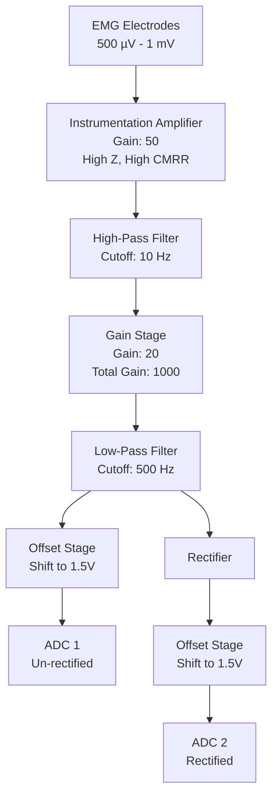

# EMG_BCI

## Introduction
This repository contains the documentation, hardware files, and software files for a simple electromyogram front end. The purpose is to create a simple interface to aquire the signals and also improve my hardware and software design skills. It's mostly for fun

## High level requirements

- Amplifier the signals from a 2 electrode from an EMG signal
- transfer the data from to a secondary device

## Hardware block diagram

- The EMG signals will be around 500 uV - 1 mV. Will scale the signals with a gain of about 1000 to make the output swing around 0.5 - 1 V
- The first stage is the instrumentation amplifier. It has a very high impedence input, and large common mode rejection. It also has a gain stage built in, which is chosen as 50
- The second stage would be the high pass filter. Removed any high frequency signals and prevents aliasing when sampling occurs. The cutoff frequency is 10 Hz, which is the lower frequency of the muscle fibers
- The third stage is a gain stage. The gain is set to 20, putting the final gain at 1000.
- The fourth state is the low pass filter. The cutoff frequency was set to 500 Hz, which is the upper limit of the muscle fibers.
- The fifth stage is the rectifier stage.
- The sixth stage is the offset stage, which adds an offset to shift the 0 point of the signal to be 1.5V. This is because many microcontrollers use +3.3V and we want to avoid applying a negative voltage on the ADC
- The sevent stage is the ADC, which can record the EMG signals. To give some options about which signal can be used in the signal processing. I want to use one ADC for the un-rectified signal, and another for the rectified signal.

- There are a couple of options when using the signal for an EMG:
  
  - one option is to use the raw EMG data and do the signal processing on those values. After performing an FFT will get the frequency data from them
  - another option is to rectify the signal, this would give an positive average value for the signal
  - with the rectified signal, can take the RMS and filterd values of it to get the average value of the amount of exertion from the muscles
 
## Communication interface

- The communication interface will be used to transfer the digitized EMG signals to an external device. This just depends on what interface the ADC's end up using. Most likely it will end up being I2C since that seems to be commonly used on ADC IC's
