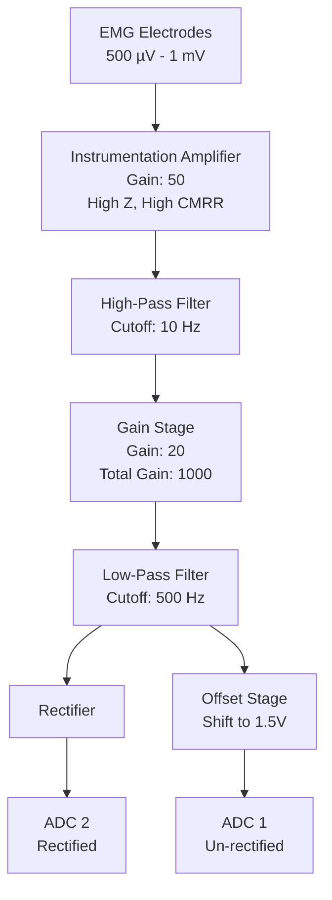

# EMG_BCI

## Introduction
This repository contains the documentation, hardware files, and software files for a simple electromyogram front end. The purpose is to create a simple interface to aquire the signals and also improve my hardware and software design skills. It's mostly for fun

## High level requirements

- Amplifier the signals from a 2 electrode from an EMG signal
- transfer the data from to a secondary device

## Hardware block diagram

```mermaid
graph TD
    A[EMG Electrodes<br>500 µV - 1 mV] --> B[Instrumentation Amplifier<br>Gain: 50<br>High Z, High CMRR]
    B --> C[High-Pass Filter<br>Cutoff: 10 Hz]
    C --> D[Gain Stage<br>Gain: 20<br>Total Gain: 1000]
    D --> E[Low-Pass Filter<br>Cutoff: 500 Hz]
    E --> F[Rectifier]
    E --> G[Offset Stage<br>Shift to 1.5V]
    G --> H[ADC 1<br>Un-rectified]
    F --> I[ADC 2<br>Rectified]

```
- The EMG signals will be around 500 uV - 1 mV. Will scale the signals with a gain of about 1000 to make the output swing around 0.5 - 1 V
- The first stage is the instrumentation amplifier. It has a very high impedence input, and large common mode rejection. It also has a gain stage built in, which is chosen as 50
- The second stage would be the high pass filter. Removed any high frequency signals and prevents aliasing when sampling occurs. The cutoff frequency is 10 Hz, which is the lower frequency of the muscle fibers
- The third stage is a gain stage. The gain is set to 20, putting the final gain at 1000.
- The fourth state is the low pass filter. The cutoff frequency was set to 500 Hz, which is the upper limit of the muscle fibers.
- The fifth stage is the rectifier stage.
- The sixth stage is the offset stage, which adds an offset to shift the 0 point of the signal to be 1.5V. This is because many microcontrollers use +3.3V and we want to avoid applying a negative voltage on the ADC
- The sevent stage is the ADC, which can record the EMG signals. To give some options about which signal can be used in the signal processing. I want to use one ADC for the un-rectified signal, and another for the rectified signal.

- There are a couple of options when using the signal for an EMG:
  
  - one option is to use the raw EMG data and do the signal processing on those values. After performing an FFT will get the frequency data from them
  - another option is to rectify the signal, this would give an positive average value for the signal
  - with the rectified signal, can take the RMS and filterd values of it to get the average value of the amount of exertion from the muscles
 
## Communication interface

- The communication interface will be used to transfer the digitized EMG signals to an external device. The ADC chosen (MCP 3202) uses an SPI interface.

## Test results 
Here are some of the results from testing the front end. The analog discovery module was used to insert a signal at the front of the instrumentation amplifier and the output at the different test points was recorded

### Instrumentation amplifier
The following table shows in the input and outputs for the instrumentation amplifier stage:

| Input | Offset | Output PK1 | Output PK2 | Out Offset | Diff | Gain | Offset Gain |
| :--- | :--- | :--- | :--- | :--- | :--- | :--- | :--- |
| 0.01 | 0.5 | 1.478 | 1.5204 | 1.4992 | 0.0424 | 4.24 | 1.8984 |
| 0.05 | 0.5 | 1.398 | 1.598 | 1.498 | 0.2 | 4 | 1.896 |
| 0.06 | 0.5 | 1.381 | 1.6175 | 1.49925 | 0.2365 | 3.94166667 | 1.8985 |
| 0.1 | 0.5 | 1.3 | 1.695 | 1.4975 | 0.395 | 3.95 | 1.895 |
| 0.15 | 0.5 | 1.202 | 1.796 | 1.499 | 0.594 | 3.96 | 1.898 |
| 0.05 | 0.1 | 0.621 | 0.819 | 0.72 | 0.198 | 3.96 | 1.7 |
| 0.05 | 0.2 | 0.814 | 1.01 | 0.912 | 0.196 | 3.92 | 1.81 |
| 0.05 | 0.4 | 1.207 | 1.402 | 1.3045 | 0.195 | 3.9 | 1.88625 |
| 0.05 | 0.6 | 1.596 | 1.792 | 1.694 | 0.196 | 3.92 | 1.90666667 |
| 0.05 | 0.7 | 1.789 | 1.985 | 1.887 | 0.196 | 3.92 | 1.91 |
| 0.05 | 0.8 | 1.984 | 2.181 | 2.0825 | 0.197 | 3.94 | 1.915625 |
| 0.05 | 0.9 | 2.181 | 2.376 | 2.2785 | 0.195 | 3.9 | 1.92055556 |
| 0.05 | 0 | 0.547 | 0.626 | 0.5865 | 0.079 | 1.58 | *Undefined (NaN)* |

couple of things to note:
- for some reason the gain of the amplifier is 4. From the datasheet since the gain pins is connected to HIGH it should be 50. Not sure why it isn't working as it should. Will have to do more investigation
- the offset did not work as I expected. It just cut off the zero point of the amplifier so when a negative value was put in, it was still cut off. I should have connected a negative supply to it in order to not lose the negative information or apply an offset to it using a summing amplifer. Since there is a high pass filter after it, the offset would likely removed anyways.

### TP2 - Output of the high pass filter and gain stage

The following table shows the data:

| Input | offset | output pk1 | output pk2 | out offset | diff | gain |
| :--- | :--- | :--- | :--- | :--- | :--- | :--- |
| 0.01 | 0.5 | -0.406 | 0.388 | -0.018 | 0.794 | 79.4 |
| 0.001 | 0.5 | -0.0375 | 0.0429 | 0.0054 | 0.0804 | 80.4 |
| 0.015 | 0.5 | -0.59 | 0.602 | 0.012 | 1.192 | 79.46667 |
| 0.02 | 0.5 | -0.782 | 0.798 | 0.016 | 1.58 | 79 |
| 0.03 | 0.5 | -1.118 | 1.1959 | 0.0159 | 2.3759 | 79.19667 |

### TP3 - Output of the low pass filter / The entire system

| Input | offset | output pk1 | output pk2 | out offset | diff | gain |
| :--- | :--- | :--- | :--- | :--- | :--- | :--- |
| 0.03 | 0.5 | -1.00E-02 | 5.64E-03 | -2.20E-03 | 1.57E-02 | 0.522333 |
| 0.03 | 0.5 | -6.79E-01 | 6.79E-01 | 0.00E+00 | 1.36E+00 | 45.26667 |
| 0.03 | 0.5 | -1.178 | 1.178 | 0.00E+00 | 2.36E+00 | 78.53333 |
| 0.03 | 0.5 | -1.178 | 1.178 | 0.00E+00 | 2.36E+00 | 78.53333 |
| 0.03 | 0.5 | -1.178 | 1.178 | 0.00E+00 | 2.36E+00 | 78.53333 |
| 0.03 | 0.5 | -1.1315 | 1.131 | -2.50E-04 | 2.26E+00 | 75.41667 |
| 0.03 | 0.5 | -1.014 | 1.014 | 0.00E+00 | 2.03E+00 | 67.6 |
| 0.03 | 0.5 | -8.62E-01 | 8.68E-01 | 3.00E-03 | 1.73E+00 | 57.66667 |
| 0.03 | 0.5 | -7.10E-01 | 7.04E-01 | -3.00E-03 | 1.41E+00 | 47.13333 |
| 0.03 | 0.5 | -5.64E-01 | 5.70E-01 | 3.00E-03 | 1.13E+00 | 37.8 |
| 0.03 | 0.5 | -4.70E-01 | 4.59E-01 | -5.50E-03 | 9.29E-01 | 30.96667 |
| 0.03 | 0.5 | -3.65E-01 | 3.71E-01 | 3.00E-03 | 7.36E-01 | 24.53333 |
| 0.03 | 0.5 | -3.12E-01 | 3.12E-01 | 0.00E+00 | 6.24E-01 | 20.8 |
| 0.03 | 0.5 | -2.01E-01 | 2.01E-01 | 0.00E+00 | 4.02E-01 | 13.4 |
| 0.03 | 0.5 | -1.45E-01 | 1.42E-01 | -1.50E-03 | 2.87E-01 | 9.566667 |
| 0.03 | 0

The graphs of the final table are:

The frequency response has the desired shape. The cutoff frequnecy is around 500 Hz. However, since the gain stage of the instrumentation amplifier was off for some reason, the final gain is off as well. This is annoying.

